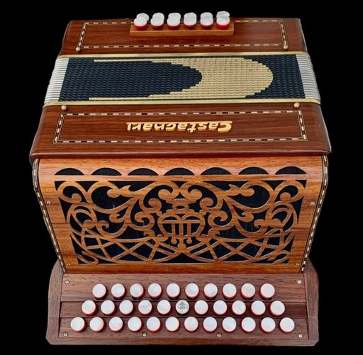
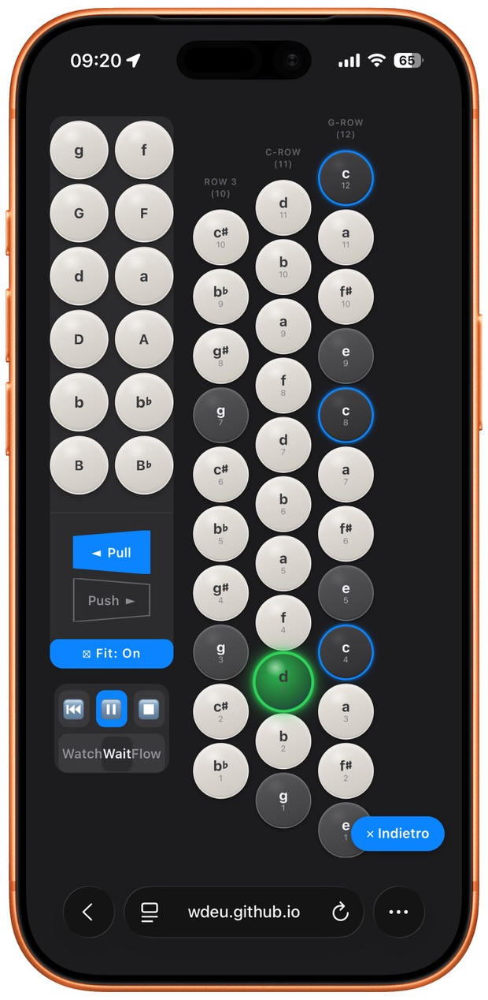
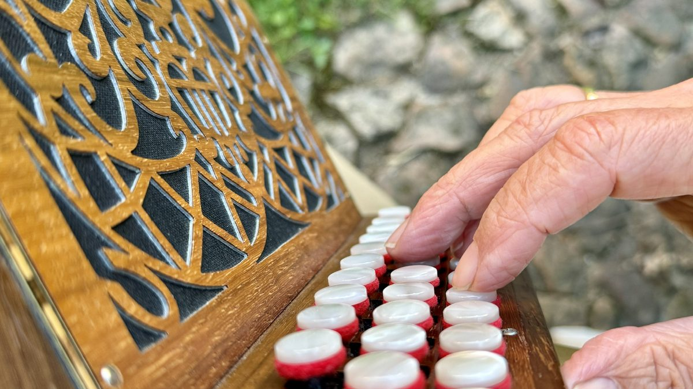

# Castagnari Benny Accordion — Interactive Learning Tool

An interactive learning tool for the **Castagnari Benny C/G, 3-row, Heim Standard** diatonic button accordion. It visualises every button on both bellows directions, plays authentic sound, and teaches whole pieces through a follow-the-lights **Play-Along** system that imports MusicXML and MIDI.

<table>
<tr>
<td width="33%" align="center" valign="top">
<br>
<sub><b>The instrument</b> — Castagnari Benny C/G</sub>
</td>
<td width="33%" align="center" valign="top">
<br>
<sub>👂 <b>The app</b> — hears you play along</sub>
</td>
<td width="33%" align="center" valign="top">
<br>
<sub>🎶 <b>Player's view</b> — same buttons, same hands</sub>
</td>
</tr>
</table>

The app mirrors what the player sees looking down at the keyboard, so the screen and the real Benny line up button for button. Practise a tune on the screen on the train without the instrument, or at home with both hands on the Benny while the app listens and follows along.

**Live:** https://wdeu.github.io/benny-accordion (mirrored at https://benny.wdeu.de)
**Source:** https://github.com/wdeu/benny-accordion

Runs in any modern browser, on desktop, iPad and iPhone. No installation, no libraries, works offline after first load.

---

## What it does

### Button visualisation
- All three rows shown from the **player's perspective**: G-row (12), C-row (11), Heim/helper row (10).
- **Push and Pull** layouts, switched with one tap. A blue frame marks Push.
- Note name large, position number small — labels follow international convention (B, not H).

### Sound
- "Benny Original" voice derived from FFT spectral analysis of a real Castagnari Benny.
- Bass modelled with octave coupling and spectrally-verified chord voicings.
- Touch-sensitive treble and bass: hold to sustain, release to fade.
- Four tone options (Benny Original, Accordion-like, Pure, Bright).

### Jam-Box
- 13 chord types and 6 modal scales (Ionian → Aeolian).
- 9 root notes (C D E F G A Bb Ab Eb) matching the real bass layout.
- Arpeggio playback with tempo and loop; treble buttons light in sync.

### Play-Along (visual learning)
- A reduced view: bass, treble and bellows only.
- **Fit-to-Screen** scales the layout to the window — shrinks to fit phone/tablet, enlarges to fill a desktop window. On by default when entering Play-Along.
- On iPhone portrait, bass and treble sit side by side with no scrolling.

---

## Song mode — learn a whole piece

Load a score and the app drives the buttons for you: the note to play **glows green**, its bass button lights with it, and the bellows direction switches automatically with an unmissable signal (blue frame + flicker) whenever the piece changes direction.

### Import
- **MusicXML** (`.mxl`, `.xml`, `.musicxml`) — the accurate path. Chord symbols in the score drive the bellows direction.
- **MIDI** (`.mid`, `.midi`) — the fallback for the many files that were never prepared in a notation editor. Since raw MIDI carries no chord symbols, the chord is **estimated per measure** from the notes and feeds the same bellows logic.
- The melody is taken from the top line; the bass is read from a real bass staff when the arrangement has one (**Plan A**), otherwise distilled from the chord symbols (**Plan B**). The status line tells you which was used.

### Three practice stages
You slide along a continuum from passive to active as muscle memory builds:

- **Watch** — the piece plays itself: notes sound, lights move, you observe.
- **Wait** — the play-head stops at each note and waits until you play the right one. No clock pressure, no penalty for a wrong button. This is trial-and-error practice.
- **Flow** — the clock runs at your chosen tempo; the lights mark the beat, but you keep up yourself. This is the dance phase.

A **tempo slider** (40–200 bpm) sets the pace in Watch and Flow.

### 🎤 Listen mode (real instrument)
In **Wait**, you can turn on **🎤 Listen**. The app uses the microphone to hear your real Benny and advances the play-head when it detects the correct melody pitch — so you can keep both hands on the instrument instead of tapping the screen.

- **Off by default.** Asks for microphone permission only when switched on.
- Falls back to tapping automatically if permission is denied or unavailable — it can never lock you out.
- Confirms the **pitch**, not the specific button or bellows; the lights still teach button and direction.
- Audio is analysed locally and never leaves the device.

---

## My Repertoire — analysed pieces, grouped by practice status

The **🎵 Repertoire** dialog has a **Meine Stücke** tab alongside the curated reference list. It reads `repertoire/index.json`, generated by the analysis pipeline in [`tools/`](tools/):

- Each piece is scored with the **same bellows-load metric** as loading a file by hand (`tools/lib/benny-core.mjs`, kept in sync with the in-app resolver), plus an `unplayablePct` for notes with no button at all, a difficulty tier (leicht/mittel/schwer), and metadata (key, meter, bpm, type).
- Grouped by **Übestatus** (Kann ich / In Arbeit / Neu) — editable right in the list, persisted in `localStorage`. Sorted by difficulty within each group.
- Tap a piece to load it straight into Watch/Wait/Flow; a 📜 link opens the same piece with D.E.S. tablature in [Soufflet](https://wdeu.github.io/soufflet/).
- **⇄ sister-app toggle** (bottom-left, mirrored in Soufflet): switches to the sister app with the same repertoire piece loaded (`?piece=<id>` deep link). With both apps open on the same origin, loading a piece in one makes the other **follow live** (localStorage events) — ideal for split-screen practice.
- Only pieces marked `publish: true` in the index are synced into this repo (`repertoire/`) and go live — the full analysed collection stays local under `~/Projects/repertoire/`, so copyrighted arrangements aren't published by default.

Building the repertoire:
```bash
cd tools
node analyze-repertoire.mjs --src ~/Projects/partituren --out ~/Projects/repertoire \
     [--convert] [--fetch-jmib] [--sync ~/Projects/benny-accordion/repertoire]
node analyze-repertoire.mjs --out ~/Projects/repertoire --publish "Muster" --sync ~/Projects/benny-accordion/repertoire
```
`--convert` batch-converts `.mscz` via the MuseScore 4 CLI; `--fetch-jmib` pulls Jean-Michel Bencetti's free score bank (jmi.ovh); `--publish`/`--unpublish`/`--list` curate what's public without hand-editing JSON. See `tools/curate-titles.mjs` for cleaning up filename-derived titles/artists.

---

## How to use it

1. Open the live link, or save the page to your home screen as a web app.
2. Explore buttons in Push/Pull, or open the Jam-Box for chords and scales.
3. For a piece: tap **📂 Load**, choose a `.mxl`/`.xml` or `.mid` file.
4. Start in **Watch** to see it, switch to **Wait** to practise note by note, then **Flow** to bring it up to tempo.
5. At the real instrument, enter **Wait** and enable **🎤 Listen**.

---

## Languages

Interface available in **English, German, French and Italian**. Button labels are language-independent by design, so only the surrounding UI text changes.

---

## Technical notes

- Single HTML file, ~135 KB, no framework and no external libraries.
- Web Audio API for synthesis and microphone pitch detection (autocorrelation).
- MusicXML `.mxl` unzipped in-browser via the native `DecompressionStream`; MIDI parsed directly (SMF format 0/1).
- PWA-capable; works offline after first load.
- The keyboard layout lives only in `BUTTON_OCTAVES` inside the HTML and is photo-verified against the instrument — it is the single source of truth.

## Repository layout

```
index.html                — the app itself (UI, logic, audio engine, repertoire modal)
assets/                   — icons, manifest.json, hero images
repertoire/               — synced subset of the analysed repertoire (publish:true only)
tools/                    — Node analysis pipeline (analyze-repertoire.mjs, curate-titles.mjs, lib/)
.ionos-overrides/         — files that should differ ONLY on the benny.wdeu.de mirror
                            (e.g. a white-framed home-screen icon to tell the two
                            installs apart); layered on top after each IONOS sync,
                            excluded again on pull.
CHANGELOG.md, DEPLOYMENT.md, INSTALLATION.md
```

## Deploy

- **GitHub Pages**: automatic on every push to `main`.
- **IONOS mirror** (`benny.wdeu.de`): via Raycast script `~/Projects/raycast-scripts/benny-deploy.sh`, which delegates the file sync to `ionos-sync.sh` (also used by Soufflet). That script layers `.ionos-overrides/` on top after the main sync.

---

## Credits & licence

Created by Werner Deuermeier for the Castagnari Benny C/G community.
For personal and educational use. Forks and adaptations welcome with attribution; please don't sell it commercially without asking.

*Castagnari is a trademark of Fisarmoniche Castagnari s.r.l. This is an independent community project.*
