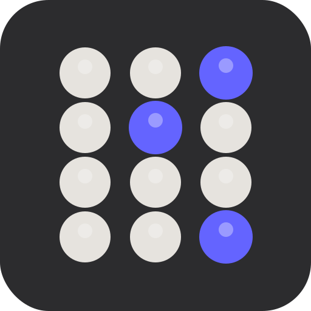

# Castagnari Benny Accordion

**Interactive Learning Tool · C/G · 3-reihig · Heim**

[](LICENSE)
[](https://github.com/wdeu/benny-accordion/releases)
[](https://wdeu.github.io/benny-accordion)

An interactive web application for visualizing and learning the **Castagnari Benny C/G (3-row, Heim tuning)** diatonic accordion. Perfect for students, teachers, and players exploring French traditional music, Bourrées, and modal playing.

🔗 **[Try it live!](https://wdeu.github.io/benny-accordion)**

---

## ✨ Features (v5.7.6)

### 🪗 Interactive Accordion Visualization
- **Player perspective**: See the accordion from above, exactly as you play it
- **3-row layout**: G-row (12 buttons), C-row (11 buttons), Helper row (10 buttons)
- **Realistic button styling**: Pearlescent buttons with subtle highlights
- **Topographic offset**: Rows are visually offset to match the physical instrument
- **Bass section**: 2 columns × 6 rows with chord/bass distinction

### 🎵 Music Theory Tools
- **Chord visualization**: 13 chord types (Dur, Moll, dim, aug, sus2, sus4, 7, maj7, m7, dim7, ø, 6, m6)
- **Modal scales**: 6 church modes (Ionian/Dur, Dorian, Phrygian, Lydian, Mixolydian, Aeolian/Moll)
- **9 root notes**: C, D, E, F, G, A, Bb, Ab, Eb (all available bass tones)
- **Real-time highlighting**: See which buttons to press for any chord or scale
- **Availability check**: Shows which notes are missing on current bellows direction

### 🔊 Audio Playback Engine (v5.5–5.7.6)
- **Benny Original sound**: Synthesized tone based on FFT analysis of real Castagnari Benny
- **Spectral accuracy**: 10 harmonics with authentic amplitude ratios
- **Inharmonicity simulation**: Subtle detuning (3-7 cents) for organic reed character
- **Chord mode**: Play all chord tones simultaneously
- **Scale mode**: Arpeggio playback ascending from root note
- **Adjustable tempo**: 0.2s - 1.0s per note (default: 0.5s)
- **Loop mode**: Endless repetition for practice
- **4 tone types**: Benny Original (default), Accordion-like, Pure, Bright
- **Auto-play**: Automatic playback when selecting chords/scales
- **Stop button**: Immediate playback termination
- **Authentic bass voicings**: Spektral-analysiert · Mellow (E, Eb, D) vs Brilliant

### 🎨 Visual Improvements (v5.7)
- **International notation**: Uppercase (C, G...) = Akkord · lowercase (c, g...) = Einzelton
- **Button display**: Note name large and bold, position number small and gray
- **PUSH indicator**: Blue border around treble area when in Push direction
- **Musical symbols**: ♭ and ♯ throughout (A♭ instead of Ab, C♯ instead of C#)
- **Heim-Info**: Expandable system info in legend (Corgeron, modal strengths, notation)
- **Scale hints**: Contextual Heim-layout recommendations when selecting scales

### 📱 iPad ONE Screen Layout (v5.3+)
- **3-column grid**: Bass | Treble | Jam-Box
- **Sticky columns**: Jam-Box stays visible while scrolling
- **Optimized spacing**: Compact UI for tablet landscape mode
- **Responsive design**: Works on desktop, tablet, and mobile

### 🎨 Modal Highlighting (NEW in v5.3!)
- **Dim non-scale notes**: Non-modal buttons fade to 30% opacity
- **Highlight scale tones**: Blue border with glow effect
- **Root emphasis**: Root note gets extra visual weight
- **Practice mode**: See exactly which buttons to play for modal jamming

### 🎛️ Bellows Control
- **Double trapezoid switches**: Top and bottom of interface
- **Minimal mode toggle**: Compact segmented control alternative
- **Visual feedback**: Active direction clearly marked
- **Push/Pull layouts**: Complete button mappings for both directions

---

## 🎯 Use Cases

### For Students
- **Learn chord shapes** on your specific accordion model
- **Practice modal scales** with visual and audio guidance
- **Understand bellows strategy** with pull-dominant technique
- **Build muscle memory** by matching physical buttons to screen

### For Teachers
- **Demonstrate fingering** visually during lessons
- **Explain modal theory** with interactive examples
- **Plan practice routines** using specific chord progressions
- **Show bellows economy** principles in context

### For Composers/Arrangers
- **Check note availability** on Heim-tuned accordions
- **Explore modal possibilities** for authentic folk music
- **Verify fingering practicality** before writing arrangements
- **Test chord voicings** specific to 3-row diatonic

---

## 🚀 Quick Start

### Option 1: Online (Easiest)
Visit **[wdeu.github.io/benny-accordion](https://wdeu.github.io/benny-accordion)**

### Option 2: iPhone/iPad Home Screen
1. Open in Safari: [wdeu.github.io/benny-accordion](https://wdeu.github.io/benny-accordion)
2. Tap Share button (square with arrow)
3. Scroll to "Add to Home Screen"
4. Tap "Add" → Now it's an app!

### Option 3: Local Copy
```bash
# Clone the repository
git clone https://github.com/wdeu/benny-accordion.git
cd benny-accordion

# Open in browser
open index.html
# or on Linux: xdg-open index.html
```

**Requirements:** Any modern browser (Chrome, Firefox, Safari, Edge)  
**Internet:** Not required after initial load (fully offline-capable)

---

## 🎓 How to Use

### Basic Workflow
1. **Select bellows direction**: Pull or Push (trapezoid buttons)
2. **Choose chord/scale**: Click type (e.g., "Dur", "Dorisch")
3. **Pick root note**: Click button (e.g., "C", "D", "G")
4. **See highlighted buttons**: Active notes light up on treble/bass
5. **Play audio** (optional): Press ▶️ Play button

### Modal Jamming Workflow (NEW!)
1. Select a **modal scale** (e.g., "Dorisch")
2. Choose **root note** (e.g., "D")
3. Select **Benny Original** tone for authentic sound
4. Set **tempo** slower (0.7s recommended for practice)
5. Enable **Loop ∞**
6. Press **▶️ Play**
6. **Watch**: Only scale tones highlighted (blue border)
7. **Play along** on your accordion!
8. Press **⏹️ Stop** when done

### Bass Triads (Quick Mode)
1. Click any **bass button** (e.g., "C" or "c")
2. Uppercase = Major triad (C-E-G)
3. Lowercase = Minor triad (C-Eb-G)
4. See chord tones highlighted on treble side

### iPad Landscape Mode
- **Left column**: Bellows control + Bass (sticky)
- **Center column**: Treble buttons (scrollable if needed)
- **Right column**: Jam-Box controls (sticky)
- Everything visible on ONE screen!

---

## 🎵 Pedagogical Approach

This tool embodies a **pull-dominant bellows strategy** (75-80% PULL movements) developed specifically for the Castagnari Benny C/G with Heim tuning:

### 5 Core Bellows Rules
1. **Pull is the "level"**: Play entire phrases on pull
2. **Push = articulation**: Use push for accents and rhythmic cuts, not movement
3. **Helper row = legato tool**: The 3rd row provides directional stability and modal color
4. **Bass follows treble**: Don't force mechanical alternating bass patterns
5. **Energy from tension**: Musical energy comes from bellows pressure, not direction changes

### Why the Helper Row Matters
The **3. Reihe (Helferreihe)** is essential for:
- **Modal playing**: Access to F (Dorian character), Bb (minor pieces)
- **Bellows economy**: Reduces forced direction changes
- **Authentic folk sound**: Characteristic tones for French traditional music
- **Legato technique**: Smooth melodic lines without pumping


---

## 🎵 Bass System Spectral Analysis

The bass system was reverse-engineered through FFT (Fast Fourier Transform) spectral analysis of real Castagnari Benny recordings to ensure authentic sound reproduction.

**[→ Complete technical analysis](docs/BASS_ANALYSIS.md)**

### Key Discovery: Uppercase vs Lowercase Buttons

Traditional accordion literature describes bass buttons as "root + chord," but spectral analysis revealed a more sophisticated system:

**Uppercase buttons (C, G, F, E...)** - Root only in 2 octaves:
```
C → C2 (65 Hz) + C3 (131 Hz)
    Voice L (Low) + Voice M (Medium)
```

**Lowercase buttons (c, g, f, e...)** - Root in 3 octaves + High Fifth:
```
c → C2 (65 Hz) + C3 (131 Hz) + C4 (262 Hz) + G4 (392 Hz)
    Voice L      + Voice M      + Voice H      + High Fifth
    
Total: 4 voices (much fuller, more brilliant sound!)
```

### Why This Matters

**High fifth placement:**
- Fifth is in HIGH register (G4 = 392 Hz), not low (G2/G3)
- Creates brilliance without muddying the bass
- Measured in real recording at 392 Hz peak

**Extra root octave:**
- Chord buttons add C4 (262 Hz), not just C2 + C3
- Adds fullness without losing bass foundation
- Spectral centroid increases ~80 Hz (deeper → fuller)

**Authentic recreation:**
- All frequencies match measured FFT peaks
- Validated by A/B testing with real Castagnari Benny
- Creates characteristic "brilliant yet grounded" bass sound

### Measured Spectral Peaks

| Button | Type | Frequencies (Hz) | Notes |
|--------|------|------------------|-------|
| **C** | Root | 131, 393 | C3 + harmonics |
| **c** | Chord | 131, 262, 393 | C3 + C4 + G4 |
| **G** | Root | 98, 197 | G2 + G3 |
| **g** | Chord | 197, 294, 392 | G3 + D4 + G4 |

See [complete bass analysis](docs/BASS_ANALYSIS.md) for:
- Full FFT results for all 24 bass buttons
- Detailed frequency tables (PUSH and PULL)
- Analysis methodology and validation
- Comparison of expected vs measured frequencies


---

## 🛠️ Technical Details

### Built With
- **Pure HTML5/CSS3/JavaScript**: No frameworks, no dependencies
- **Web Audio API**: Real-time sound synthesis
- **CSS Grid & Flexbox**: Responsive layout system
- **LocalStorage**: Persistent user preferences
- **SVG**: Scalable trapezoid controls

### Browser Support
- ✅ Chrome 90+
- ✅ Firefox 88+
- ✅ Safari 14+ (including iOS)
- ✅ Edge 90+

### File Size
- **HTML**: ~75 KB (minified, all-in-one)
- **No external dependencies**
- **Offline-capable** after first load

### Performance
- **Instant load**: Single HTML file
- **Smooth animations**: Hardware-accelerated CSS
- **Low latency audio**: Web Audio API oscillators
- **Mobile optimized**: Touch-friendly buttons

---

## 📚 Related Resources

### Teaching Materials
- `Castagnari_Skill.rtf` - Complete repertoire progression (German)
- `INSTALLATION.md` - Detailed deployment guide
- `Benny_Tonleitern.pdf` - Scale fingering charts
- `PUSHPULL.pdf` - Visual button layout reference

### Companion Projects
- **Raycast Extension** (TypeScript): Command-line accordion visualization
- **Word Documents**: Detailed fingering for specific pieces (Bourrée d'Avignon, etc.)

---

## 🗺️ Roadmap

### Completed (v5.5–5.7.6)
- [x] Spectral analysis of real Castagnari Benny (treble + all bass buttons)
- [x] Custom waveform synthesis (Benny Original sound)
- [x] Authentic bass voicings (Mellow: E, Eb, D · Brilliant: all others)
- [x] International notation (uppercase = chord, lowercase = single note)
- [x] Button display: note name large, position number small + gray
- [x] PUSH indicator: blue border on treble area
- [x] Heim-Info expandable in legend
- [x] Contextual scale recommendations
- [x] Musical symbols ♭ ♯ throughout
- [x] Raycast auto-deploy script (self-updating)

### Next (v5.8)
- [ ] Individual treble button playback (single note on click)
- [ ] Chord stacking: c + eb + g = C-Moll in treble
- [ ] Touch-sensitive duration (hold = sustain)
- [ ] Bass + treble combined (full Benny experience!)

### Later (v6.0+)
- [ ] Custom chord definitions
- [ ] Save/load chord progressions
- [ ] PDF export (fingering charts)
- [ ] Multi-chord comparison view
- [ ] Dark/Light theme toggle
- [ ] Internationalization (EN/IT/FR)
- [ ] Additional tunings (D/G, G/C)
- [ ] MIDI output support (external keyboard)

### Under Consideration
- [ ] Practice mode with timed exercises
- [ ] Record and playback melodies
- [ ] Integration with Castagnari product line
- [ ] Mobile app versions (iOS/Android)

---

## 🤝 Contributing

This project uses a **Custom Non-Commercial License**. Contributions are welcome for:

- 🐛 Bug fixes
- 📝 Documentation improvements
- 🌍 Translations
- 🎨 UI/UX enhancements
- 🎵 Additional chord/scale formulas

**Before contributing:**
1. Read the [LICENSE](LICENSE) file
2. Open an issue to discuss your idea
3. Fork and create a pull request

**Commercial use requires written permission.** See [LICENSE](LICENSE) for details.

---

## 📧 Contact & Licensing

**Author:** Werner Deuermeier  
**GitHub:** [@wdeu](https://github.com/wdeu)  
**Project:** [github.com/wdeu/benny-accordion](https://github.com/wdeu/benny-accordion)

### Commercial Licensing
Interested in:
- Integration into music education products?
- Manufacturer-branded versions?
- Custom development for other accordion models?

**Contact for commercial licensing inquiries.**

### Partnership Opportunities
Open to collaboration with:
- 🏭 Accordion manufacturers (especially Castagnari)
- 🎓 Music schools and conservatories
- 📚 Educational content publishers
- 💻 Music software companies

---

## 🙏 Acknowledgments

- **Castagnari s.r.l.**: For building exceptional diatonic accordions since 1914
- **The Bal Folk community**: For preserving French traditional music
- **Accordion teachers**: Jean Blanchard, Marc Perrone, Riccardo Tesi, Gilles Chabenat, Patrick Bouffard, and many others whose pedagogical insights informed this tool

---

## 📄 License

**Custom Non-Commercial License**

- ✅ Free for personal learning and education
- ✅ Open source code for study
- ❌ Commercial use requires permission

See [LICENSE](LICENSE) file for complete terms.

---

## 🌟 Star History

If this tool helps your accordion journey, consider giving it a ⭐ on GitHub!

---

**Version:** 5.7.6  
**Last Updated:** May 26, 2026  
**Status:** Active Development
